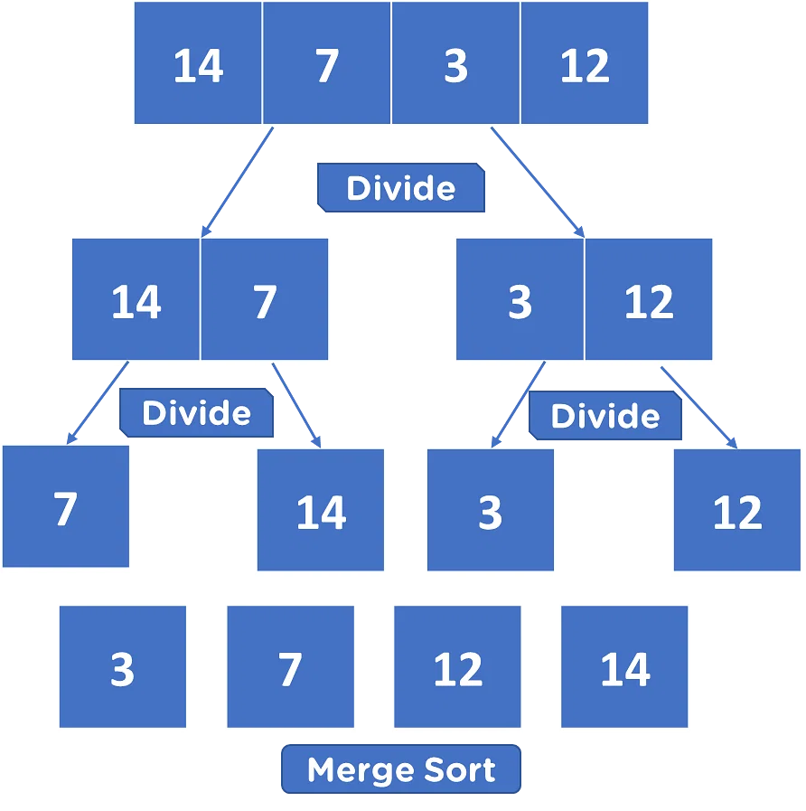

# 합병 정렬(merge sort)

## 1. 소개

알고리즘이란, 문제를 해결하기 위한 단계적인 절차를 의미한다.
합병 정렬은 큰 문제를 작은 문제로 나누어 해결하는 "분할 정복" 알고리즘의 하나이다.
이 알고리즘은 배열을 반으로 나누고, 각 부분 배열을 정렬한 다음, 정렬된 부분 배열을 합쳐서 전체 배열을 정렬하는 방식으로 동작한다.

## 2. 동작 과정

- 분할: 주어진 배열을 가운데서 반으로 나눈다. 이 단계에서 배열을 분할하여 작은 부분 배열로 만든다.
- 정복: 각 부분 배열에 합병정렬을 재귀적으로 적용한다. 이 단계에서 각 부분 배열을 정렬하여 정렬된 부분 배열을 얻는다.
- 결합: 정렬된 부분 배열을 하나의 배열로 합쳐서 결합한다. 이때, 두 부분 배열을 비교하면서 작은 값을 선택하여 결합한다.



## 3. 시간 복잡도

합병 정렬은 최악, 평균, 최선의 경우에 모두 O(n log n)의 시간 복잡도를 갖는다.
이는 대규모 데이터셋에도 효율적으로 동작한다는 장점을 가지고 있다.
합병 정렬의 시간 복잡도 O(n log n)은 배열을 반으로 나누는 데 log n의 단계가 필요하며, 각 단계에서 n개의 요소를 비교하므로 n과 곱해지게 된다.

## 4. 용어 설명

- ### 재귀적

함수가 자기 가진을 호출하여 작업을 처리하는 것을 '재귀적'이라고 한다. 합병 정렬의 경우, 작은 부분 배열을 정렬하고 결합하여 더 큰 문제를 해결하는 것이 재귀적인 접근 방식이다. '재귀'는 문제를 더 작은 단위로 쪼개서 해결하는 데 유용하여, 알고리즘 설계와 프로그래밍에서 자주 활용되는 개념 중 하나이다.

- ### 시간 복잡도

시간 복잡도는 알고리즘의 수행 시간이 입력 크기에 대한 함수로 표현한 것이다. 알고리즘의 효율성과 성능을 평가하는데 사용되며, 주로 입력 크기에 따른 연산 횟수를 나타내는데 사용된다.

시간 복잡도를 표기할 때 Big-O(빅-오) 표기법을 사용하는 이유는 알고리즘의 성능을 큰 그림으로 파악하기 위해이다. O 표기법은 주어진 알고리즘의 실행 시간이 입력 크기에 대해 어떻게 증가하는지를 나타내는 것으로, 최악의 경우, 평균적인 경우, 최선의 경우를 각각 고려하지 않고 전체적인 추이를 보기 위해 사용된다.

O(n log n)이란 표기법은 n과 log n의 곱으로 나타난다. 합병 정렬이 이런 시간 복잡도를 갖는 이유는 분할 정복 알고리즘의 특성 때문이다. 배열을 반으로 나누고, 각각의 부분 배열을 정렬한 뒤 다시 합치기 때문에, 각 단계에서 log n의 비교를 수행하고 이 단계를 n번 수행하게 된다. 따라서 전체 연산 횟수는 n \* log n이 되어 O(n log n)의 시간 복잡도를 갖게 된다.

## 5. 자바스크립트로 구현한 예시


```js
// 합병 정렬 알고리즘을 구현한 함수
function mergeSort(arr) {
  // 만약 배열의 길이가 1 이하라면 이미 정렬된 상태이므로 그대로 반환
  if (arr.length <= 1) {
    return arr;
  }

  // 배열을 반으로 나누기 위한 중간 인덱스 계산
  const middle = Math.floor(arr.length / 2);
  // 중간을 기준으로 왼쪽과 오른쪽 부분 배열로 분할
  const left = arr.slice(0, middle);
  const right = arr.slice(middle);

  // merge 함수로 분할된 부분 배열들을 결합하여 정렬된 배열을 반환
  return merge(mergeSort(left), mergeSort(right));
}

// 두 부분 배열을 비교하며 작은 값을 선택하고, 정렬된 배열을 반환하는 함수
function merge(left, right) {
  let result = [];
  let leftIndex = 0;
  let rightIndex = 0;

  // 왼쪽과 오른쪽 부분 배열을 비교하면서 작은 값을 result 배열에 추가
  while (leftIndex < left.length && rightIndex < right.length) {
    if (left[leftIndex] < right[rightIndex]) {
      result.push(left[leftIndex]);
      leftIndex++;
    } else {
      result.push(right[rightIndex]);
      rightIndex++;
    }
  }

  // 남은 요소들을 result 배열에 추가
  return result.concat(left.slice(leftIndex)).concat(right.slice(rightIndex));
}

// 정렬되지 않은 배열
const unsortedArray = [21, 10, 12, 20, 25, 13, 15, 22];
// mergeSort 함수를 사용하여 배열을 정렬
const sortedArray = mergeSort(unsortedArray);
// 정렬된 배열 출력
console.log(sortedArray);

// 출력 결과 : [10, 12, 13, 15, 20, 21, 22, 25]
```

- mergeSort 함수는 배열을 반으로 나누고 merge 함수로 결합한다.
- merge 함수는 두 부분 배열을 비교하여 작은 값을 선택하고, 정렬된 배열을 반환한다.
- 재귀적으로 호출되면서 배열이 계속 분할되고 결합되어 최종적으로 정렬된 배열을 얻는다.
