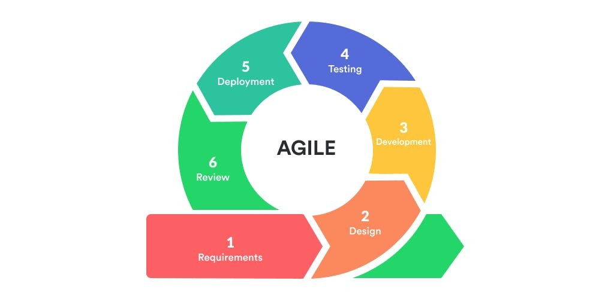
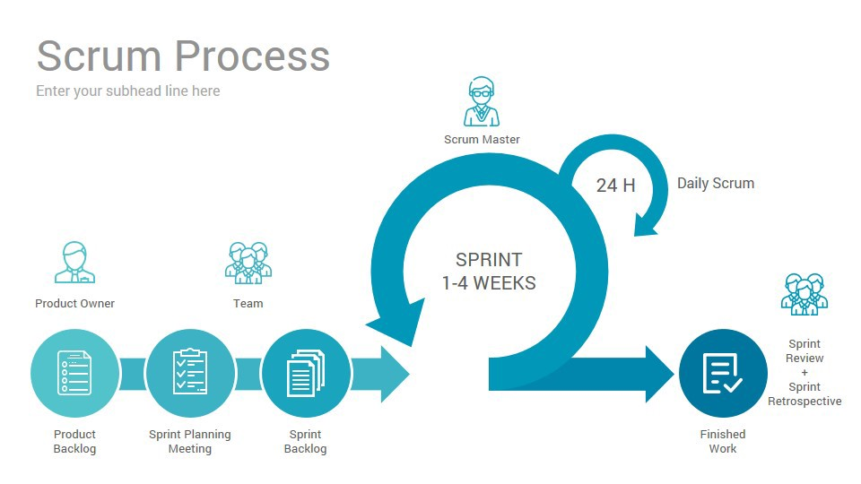
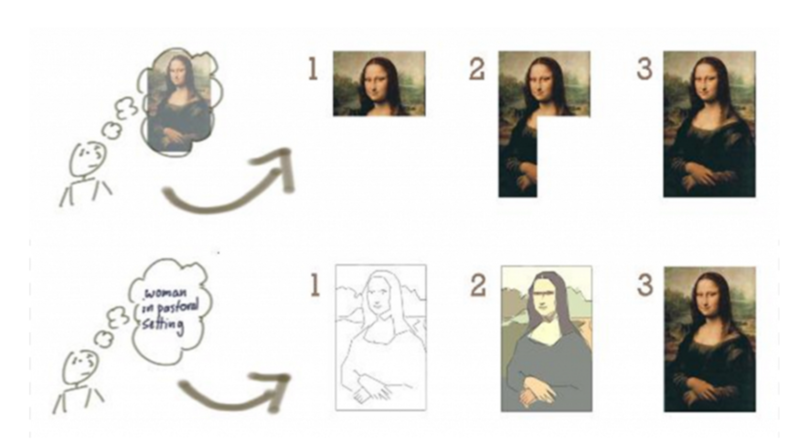
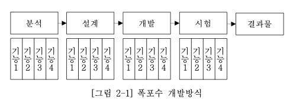

## 애자일 정리

### 소프트웨어 개발 방법론

- 소프트웨어 개발 시에 발생하는 반복적인 과정들을 체계적으로 정리한 것
- 정보공학 방법론, 객체지향 방법론, CBD(Component Base Development) 방법론, Agile 방법론, Waterfall 방법론 등
- 좋고 나쁨이 있기보다는 주어진 상황, 프로젝트의 종류 등에 따라서 그에 맞는 방법론을 활용

### 애자일 등장 배경

- 초기의 SW 개발 분야는 '군사'
- 도시 계획의 프로세스에서 방법을 본따 계획 중심의 프로세스로 SW 개발 진행
- 90년대 이후로 SW의 사용자가 일반대중으로 넓어짐 + 비즈니스 사이클이 짧아짐으로 SW 개발의 불확실성이 높아졌다.
- 이에 따라 경량 방법론 주의자들이 작업을 하면서 고쳐나가는 방식을 도입
- [애자일 소프트웨어 개발 선언](http://agilemanifesto.org/iso/ko/manifesto.html)

### 애자일 방법론

- 프로젝트를 더 작은 반복주기로 나누는 프로세스
- 반복적이고 지속적
- 기능은 비즈니스 가치 순서대로 구현
- 품질은 가능한 높게 유지
- 일정은 주로 범위를 조절하여 관리
- 애자일에서는 불확실성이 중요

```
개발 요구사항은 비즈니스 환경이나 전략 등에 의해 언제든지 변할 수 있고, 이러한 변화에 대응할 수 있어야 한다.
```

- 핵심은 '협력'과 '피드백'
- #### 협력
  - 직무 역할을 넘어서 협력
  - 개인이 통찰한 것을 다른 사람도 같이 습득 가능
  - 결과적으로는 팀 전체의 개선
- #### 피드백
  - 과거의 자신이 개발한 것을 확인하면서 학습
  - 내부적 피드백 : 내가 만든 것이 어떻게 됐는지 확인
  - 외부적 피드백 : 내가 만든 것을 다른 부서에서 사용하고, 그것을 통해서 학습

```
종합해보면 'Agile'이라는 것은 개발과정에서의 시스템 변경사항을 유연 또는 기민하게 대응할 수 있도록 방법을 제공한다는 것을 의미
```

### 애자일 방식



- 소프트웨어 개발 단계를 명확하게 구분하지 않고, 각 단계를 반복적으로 수행하면서 진행
- 이 과정에서 요구사항들은 추가하거나 제외하면서 개발
- 요구사항이 잦을 경우, 큰 프로젝트라 요구사항 분석, 설계가 어려울 경우 적합

### 애자일 종류

- Scrum(스크럼) / Kanban(칸반) / XP(Extreme Programming)

1. Scrum : 유지보수보다는 개발에 초점이 맞춰진 애자일 방법론
   

   - 제품책임자가 할 일 목록에서 스프린트 동안 해야할 일들을 결정하고 완수하여 매 스프린트마다 결과물을 산출. 그 후 회고를 통해 피드백

   ```
    *스프린트 : 프로세스에서 반복되어 진행되는 기간으로 크지 않은 양의 업무를 적당 기간동안 집중해서 업무를 수행

    평균적으로 1~2주의 기간동안 개발팀이 해낼 수 있을 정도의 업무를 진행하는 것이 목적
   ```

   - 제품 백로그 -> 스프린트 백로그 -> 스프린트 -> 일일 스크럼 회의

   - 장점 : 즉각적이거나 변경된 요구사항을 반영하기 용이 / 개발 초기에 버그 발견하기 쉬움
   - 단점 : 스프린트 기간에 어긋나는 경우가 빈번해질 경우 지연되거나 관리가 어려운 상황이 발생

2. Kanban : 연속적 흐름처리 방식

   - 스크럼의 단점을 보완하기 위해 WIP(work in progress) 개념이 생겨남
   - 스프린트 기간이 없이 연속적인 흐름(WIP)에 따라 애자일을 실행
   - WIP를 통해 동시에 개발이 진행될 수 있는 아이템의 수를 제한
   - 이슈를 우선순위에 따라 나열하고 우선숭위에 따라 이슈를 처리

3. XP : 고객과 함께 2주정도의 반복 개발을 하고, 테스트와 우선 개발을 진행

### 폭포수 방법론과 비교



- 순차적인 소프트웨어 개발 프로세스
- 모든 요구사항을 대상으로 분석, 설계, 개발, 시험을 단계적으로 진행하여 최종 결과물로 소프트웨어를 배포



- 요구사항 분석 -> 설계 -> 구현 -> 테스트 -> 유지보수
- 장점 : 수직적 진행으로 과정에 대한 이해가 쉽다.
- 단점 : 개발 도중에 추가적인 요구사항에 대한 대비책이 미비하다(추가적인 비용과 시간이 많이 듦)
