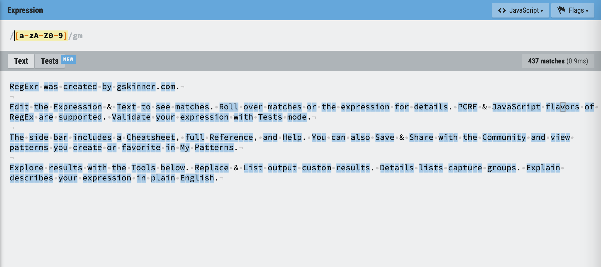
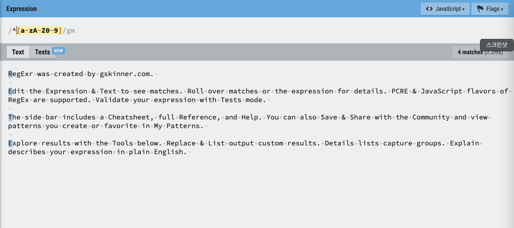

# 정규식(Regular expressions)

- 정규표현식 Regex는 Regular expressions의 약자이다.
- 텍스트에서 원하는 특정한 패턴을 찾을 때, 텍스트 형식을 검사할 때 사용한다.

### 어디서 사용할까?

- 텍스트에 한글이 들어있나? 영어가 들어있나?
- 문자로 시작하나? 숫자로 시작하나?
- 기호가 사용되었나?
- 많은 텍스트 중에 전화번호 형태의 패턴이 있나?
- 웹사이트 형태의 패턴이 있나?
- ...

### 정규표현식은 다양하게 사용된다.

- 다양한 프로그래밍 언어 내부적으로 지원.
- 텍스트나 코드에디터 에서도 정규표현식을 사용해서 검색하는 것이 가능하다.
- 찾아진 패턴을 다른 문자열로 변환 할 수 있다.
- 사용자가 입력한 데이터가 이메일이나 패스워드 같은 특정한 패턴에 부합하는지, 유효성 검사를 할 때도 사용할 수 있다.

### 어떻게 사용할까?

```
/regex?/
```

1. 정규표현식은 슬래쉬(slashes, /)를 사용해서 나타낸다.
2. 슬래쉬(/ /) 안에 찾고자하는 패턴(pattern)을 작성해주면 된다.
3. 그리고 어떤 옵션을 이용해서 검색 할 건지 플래그(flag)를 활용할 수 있다.

### 정규표현식 연습하기

- 정규표현식을 처음 접한다면 난해하고 어렵게 보이지만, 기본적인 문법을 알고 있다면 어렵지 않다.
- 정규표현식 테스트 사이트(다양한 사이트 존재) : [regexr](https://regexr.com/)
- 문법을 익히고 원하는 패턴을 작성하는 연습.
- chat GPT를 사용하는 방법.

## 문법 정리




### Groups and ranges(그룹, 레인지)

| Character | 뜻                                     |
| --------- | -------------------------------------- |
| `\|`      | 또는                                   |
| `()`      | 그룹                                   |
| `[]`      | 문자셋, 괄호안의 어떤 문자든           |
| `[^]`     | 부정 문자셋, 괄호안의 어떤 문가 아닐때 |
| `(?:)`    | 찾지만 기억하지는 않음                 |

### Quantifiers(수량)

| Character   | 뜻                                  |
| ----------- | ----------------------------------- |
| `?`         | 없거나 있거나 (zero or one)         |
| `*`         | 없거나 있거나 많거나 (zero or more) |
| `+`         | 하나 또는 많이 (one or more)        |
| `{n}`       | n번 반복                            |
| `{min,}`    | 최소                                |
| `{min,max}` | 최소, 그리고 최대                   |

### Boundary-type(단어 경계)

| Character | 뜻               |
| --------- | ---------------- |
| `\b`      | 단어 경계        |
| `\B`      | 단어 경계가 아님 |
| `^`       | 문장의 시작      |
| `$`       | 문장의 끝        |

### Character classes(문자)

| Character | 뜻                           |
| --------- | ---------------------------- |
| `\`       | 특수 문자가 아닌 문자        |
| `.`       | 어떤 글자 (줄바꿈 문자 제외) |
| `\d`      | digit 숫자                   |
| `\D`      | digit 숫자 아님              |
| `\w`      | word 문자                    |
| `\W`      | word 문자 아님               |
| `\s`      | space 공백                   |
| `\S`      | space 공백 아님              |
