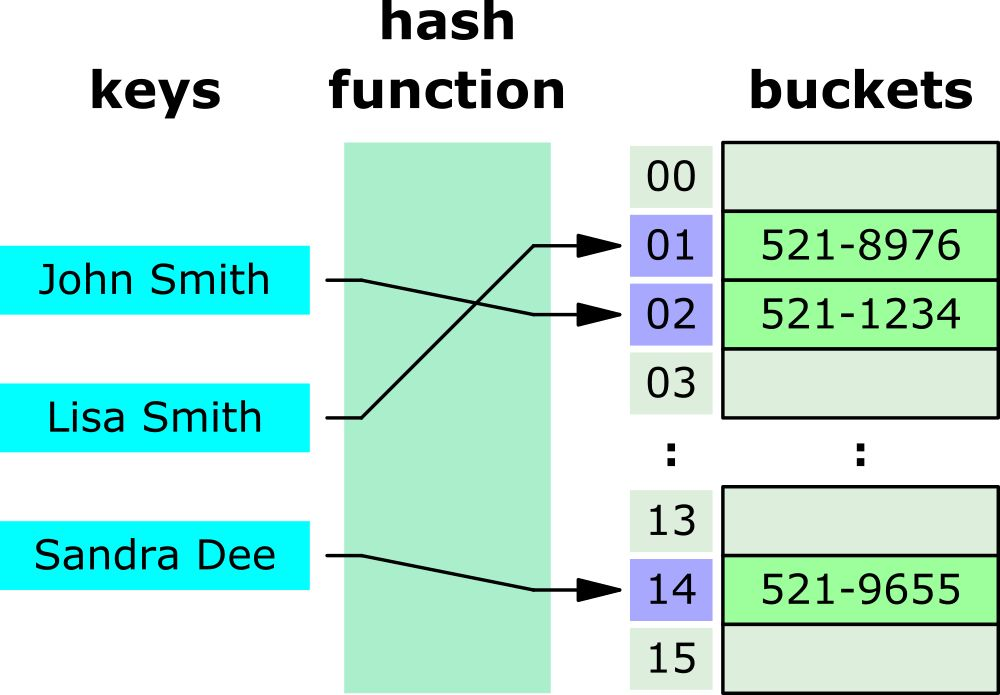
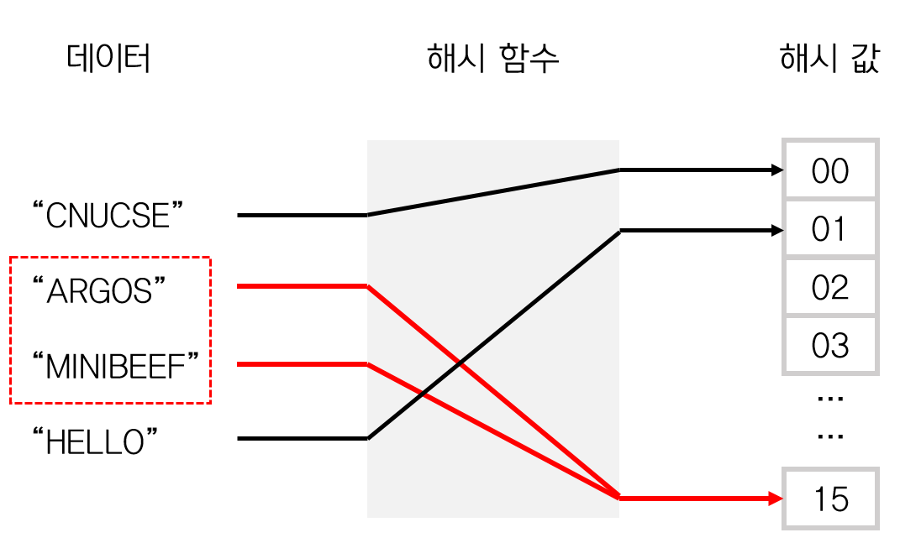
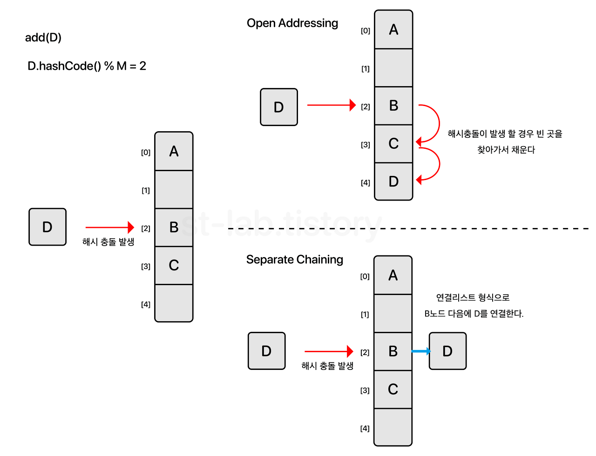
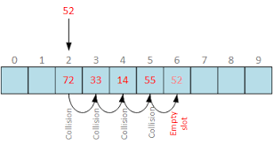
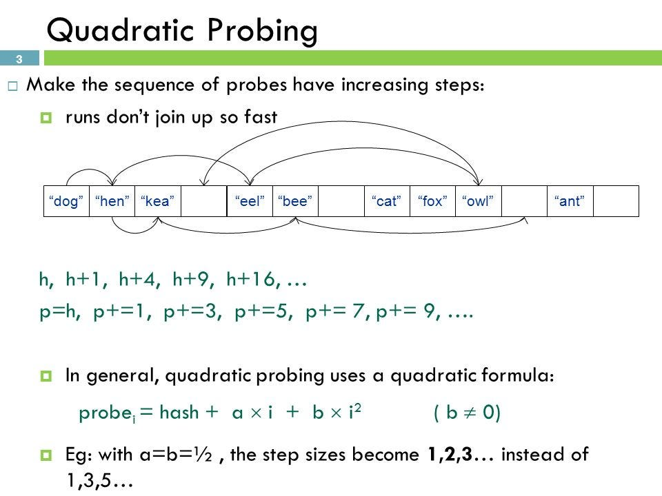
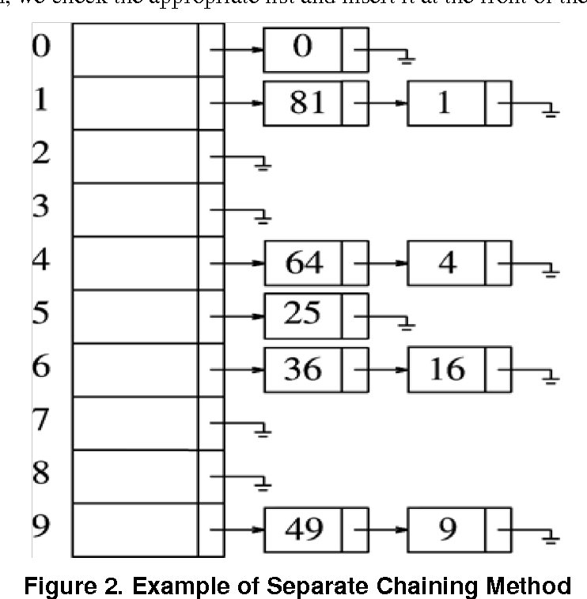

# 해시

### 데이터를 다루는 기법 중 하나

특징 : 데이터 값이 key:value 형태로 존재 / 배열의 값이 인덱스로 변환되기 때문에 시간복잡도가 O(1) 상태

```
* 시간 복잡도란?
입력값의 변화에 따라 연산을 실행할 때, 연산 횟수에 비해 시간이 얼마나 걸리는가
알고리즘을 효율적으로 구현한다는 것은 입력값 증가에 따른 시간의 비율을 최소화한다는 뜻

BIG - O 표기법
그 중 BIG - O 표기법
O(1) : 일정한 복잡도, 입력값 증가하더라도 시간이 늘어나지 않는다.
입력값의 크기와 상관없이 즉시 출력값 도출 가능
```

## 해시 테이블

key : value 값으로 데이터의 값을 저장하는 자료구조

어떤 특정 값을 해시 함수에 입력 => 출력 값을 인덱스로 삼아 데이터로 저장

대표적인 예<br/>
파이썬 - dictionary<br/>
루비 - Hash<br/>
자바 - Map

적은 자원으로도 많은 데이터를 관리할 수 있다<br/>
=> 해시를 사용하는 이유 : index만 알면 테이블의 크기와 관련없이 데이터를 빠르게 찾을 수 있다!

### 해시테이블의 특징

- 순차적으로 데이터를 저장하지 않는다
- 데이터를 비교할 때 효율적(크기가 큰 데이터를 해시로 축약할 수 있어서)
- 배열이나 이진탐색트리에 비해 속도가 획기적으로 빠르다
- value는 수정 가능하지만, key는 유니크해야 한다.
- 1:1로 매핑되어있기 때문에 검색,삽입,삭제 과정에서의 시간복잡도는 항상 O(1)



## 해시 함수

임의 길이의 데이터를 고정된 길이의 데이터로 매핑하는 과정 <br/>
매핑전 값 : KEY / 매핑후 값 : value

```
어떠한 정수를 10으로 나눈 나머지 값을 리턴하는 함수는 해시 함수인가?
```

임의의 길이를 갖는 메시지를 입력 받아서 고정된 길이의 해시값을 출력하는 함수

입력값이 새로운 데이터 형식으로 만들어지기 때문에 암호화 영역에서 중요하게 사용된다.<br/>
(대표적 사례 : SHA 알고리즘 - https://www.convertstring.com/ko/Hash/SHA256)

입력값의 일부가 변경되면 전혀 다른 값을 출력 => 눈사태 효과<br/>
즉, 역추적이 안된다 => 단방향성

### 문제점

입력값의 길이와 상관없이 고정된 길이의 값을 출력하기 때문에 같은 결과값이 나올 수 있다.

- 데이터가 많아질 수록 같은 해시값으로 충돌이 발생

## 해시 충돌



적재율(load factor) : 테이블 크기에 대한 키의 개수의 비율
키의 개수 : K / 테이블 크기 : N<br/>
이 때의 적재율 : K/N

충돌이 없을 경우에는 시간 복잡도는 O(1)이지만, 충돌이 있을 경우에는 탐색과 삭제가 O(K)만큼 소요<br/>
=> 입력값이 증가할 때 시간 또한 같은 비율로 증가한다!

해시충돌이 1도 없는 함수를 만드는 것은 불가능<br/>
특히 무한한 입력값으로 유한한 결과값을 도출해낼 때에는 더욱<br/>
(비둘기집 원리 : n+1개의 물건을 n개의 상자에 넣게 될 때 어느 한 상자에는 2개이상의 물건이 들어있다.)<br/>
=> 충돌을 완화하는 방식을 찾아야 한다.

## 해시 충돌 완화

### 1. 개방 주소법

해시 테이블 크기는 고정하면서 저장할 위치를 찾기


충돌이 발생할 경우 다른 주소에 데이터를 저장할 수 있도록 허용

문제점 : 부하율이 높을 수록(= 테이블에 저장된 데이터의 밀도가 높을수록) 성능이 급격히 저하된다.

주요 목적은 저장할 입력값을 위한 다음 공간을 찾는 것

- 선형 탐사법 : 선형으로 순차적 검색을 하는 방식

  - 해시 index에 다른 값이 이미 저장되어 있다면, 해당 해시 값에서 고정 폭을 옮겨 다음 해시값에 해당하는 곳에 저장
    

  - 문제점 : 해시 주변값이 모두 채워져 있다면 1000% 충돌

- 제곱 탐사법 : 고정폭이 아니라 제곱으로 늘어남

  - 충돌 발생가능성은 적지만, 속도의 문제가 발생

  

- 이중 해싱 :

### 2. 분리 연결법

해시 테이블의 크기를 유연하게 만드는 방식



데이터 개수의 제약이 없지만, 메모리 문제를 야기, 테이블의 부하율에 따라서 성능이 저하됨.

## 자바스크립트 객체 와 Map

key : value 값으로 이뤄져있고, key 는 유니크해서 key를 인덱스 삼아서 value 찾기가 가능<br/>
=> 그렇다면 Object는 해시테이블인가

: 그렇지 않다.
유사하지만 자바스크립트 엔진이 해시 테이블의 원리로 실행하지 않기 때문에 해시테이블은 아니다!

Map 역시도 마찬가지

```
Maps must be implemented using either hash tables or other mechanisms that, on average, provide access times that are sublinear on the number of elements in the collection. The data structure used in this specification is only intended to describe the required observable semantics of Maps. It is not intended to be a viable implementation model.
```

[링크 ECMAScript](https://tc39.es/ecma262/#sec-map-objects)

## 자바스크립트에서의 해시테이블 대안

데이터 크기가 크거나, entry들을 추가하거나 삭제하는 빈도가 더 높을 수록 object보다 Map을 사용<br/>
(MDN 추천)
